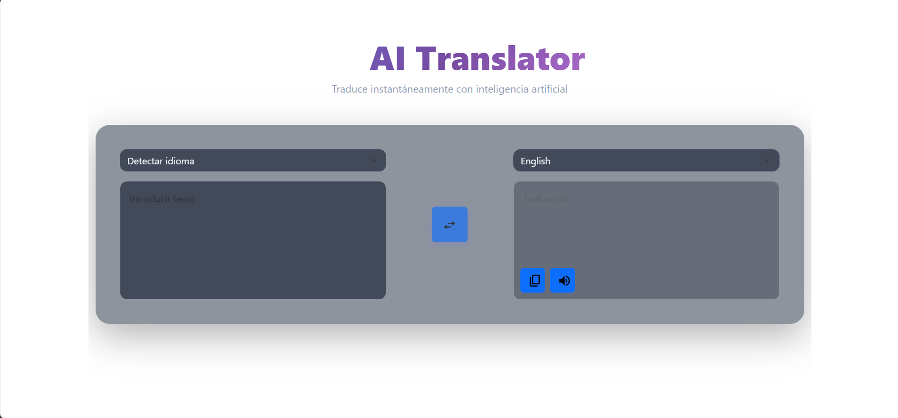

# Translate Google Clone IA ™️

Aplicación web para realizar traducciones de texto con AI



## 🌐 Live Demo

Explora la demostración en vivo del proyecto:
[Translate Google Clone IA](https://translate-google-clone-ai.vercel.app/)

## ✍️ Características

- Traducción de texto entre idiomas comunes
- Copiado de texto en portapapeles
- Audio de la traducción recibida
- Interfaz responsiva y atractiva
- **Backend propio** para proteger la clave de la API y servir los datos al frontend.

## 👨‍💻 Tecnologías utilizadas

- React JS
- Vite
- TypeScript
- Bootstrap
- Tailwindcss
- Node.js + Express (Backend)
- OpenAI
- Vercel
- Render

[](https://skillicons.dev)

<details><summary><b>Estructura del proyecto</b></summary>

```bash
Translate-Google-Clone-IA/
├── .github/
│   └── readme_assets/
│       └── translator.png
├── translate-backend/
│   ├── middlewares/
│   │   └── corsMiddlewares.js
│   ├── service/
│   │   └── openaiClient.js
│   ├── utils/
│   │   └── rateLimiter.js
│   │
│   ├── .env
│   ├── .gitignore
│   ├── server.js
│   ├── package.json
│   ├── pnpm-lock.yaml
│   ├── Procfile
│   ├── READMI.md
│   └── render.yaml
├── translate-frontend/
│   ├── public/
│   │   └── google-translate.png
│   ├── src/
│   │   ├── assets/
│   │   │   └── react.svg
│   │   ├── components/
│   │   │   ├── Icons.tsx
│   │   │   ├── LenguageSelector.tsx
│   │   │   └── TextArea.tsx
│   │   ├── hooks/
│   │   │   ├── useDebounce.ts
│   │   │   └── useStore.ts
│   │   ├── service/
│   │   │   └── translate.ts
│   │   ├── App.css
│   │   ├── App.tsx
│   │   ├── App.test.tsx
│   │   ├── constants.ts
│   │   ├── index.css
│   │   ├── main.tsx
│   │   ├── ts.config.app.json
│   │   └── types.d.ts
│   ├── .env
│   ├── .gitignore
│   ├── eslint.config.js
│   ├── index.html
│   ├── package.json
│   ├── pnpm-lock.yaml
│   ├── README.md
│   ├── tsconfig.app.json
│   ├── tsconfig.json
│   ├── tsconfig.node.json
│   └── vite.config.ts
├── README.md
```

</details>

## 🧰 Get Started

Para poner este proyecto en funcionamiento en su entorno de desarrollo, siga estas instrucciones paso a paso.

### ⚙️ Instalación & Correrlo en Local

**Step 0:**

Note :bangbang: **Backend:** La aplicación utiliza un **url** del frontend para control de CORS y un entorno de desarrollo. Por lo que se deben declarar las siguientes variables de entorno:
`FRONTEND_URL` y `NODE_ENV` en el archivo `.env`.

Note :bangbang: **Backend:** Se utiliza el modelo de **openai** para las traducciones. Por lo que se debe declarar una url en la variable de entorno:
`OPENAI_API_KEY` en el archivo `.env`.

**Step 1:**

Descargue o clone este repositorio utilizando el siguiente enlace:

```bash
git clone https://github.com/LFernando07/translate-google-clone-ai.git
```

**Step 2:**

Ir al backend
Ejecute el siguiente comando en el directorio para instalar las dependencias:

```bash
cd translate-backend
pnpm install
```

**Step 3:**
Ejecute el siguiente comando para ejecutar el servidor de desarrollo localmente:
El backend se ejecutará normalmente en [http://localhost:3001](http://localhost:3001).

```bash
pnpm run dev
```

**Step 4:**

Ir al frontend
Ejecute el siguiente comando en el directorio para instalar las dependencias:

```bash
cd translate-frontend
pnpm install
```

**Step 5:**

Ejecute el siguiente comando para ejecutar el frontend en el navegador:
El frontend se ejecutará en [http://localhost:5173](http://localhost:5173).

```bash
pnpm run dev
```

## 🔒 Environment Variables

Las variables de entorno se pueden usar para la configuración. Deben configurarse antes de ejecutar la aplicación.

**Translate-Google-Clone-AI** usa [openia](https://www.openai.io/) accede a la página oficial para poder utilizar la dependencia.

Cree un archivo `.env` en el directorio raíz del proyecto (backend) y agregue las siguientes variables de entorno:

```env
OPENAI_API_KEY=<OPENAI_API_KEY>
```

## 📋 Licencia

**Translate-Google-Clone-AI** es software de código abierto
— Ver [licensed as MIT](https://opensource.org/license/mit/) y es de uso gratuito
